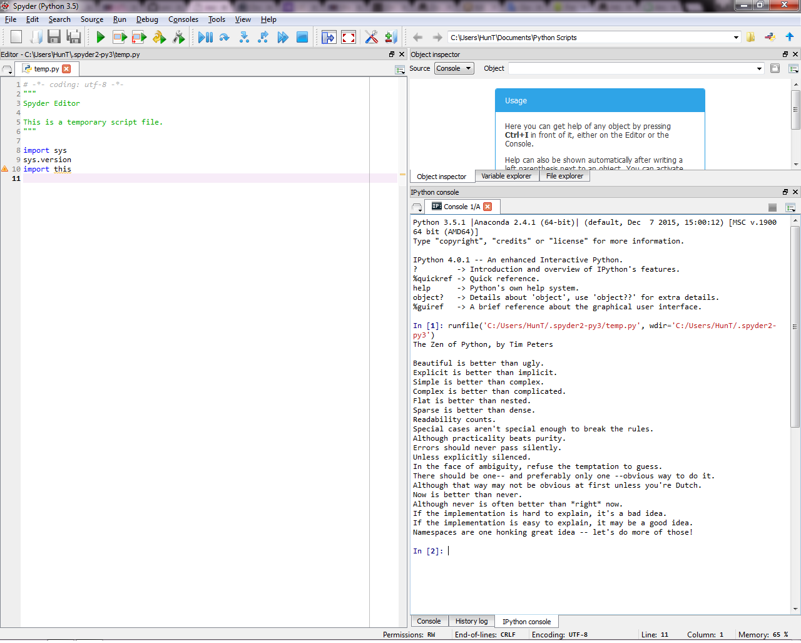

UECM3033 Assignment #1 Report
========================================================

- Prepared by: Tee Yeh Hun
- Tutorial Group: T2

--------------------------------------------------------

## Task 1 -- setup a github repository

The reports, codes and supporting documents are uploaded to Github at: 

[https://github.com/Yehhun/UECM3033_assign1]
(https://github.com/Yehhun/UECM3033_assign1)

---------------------------------------------------------

## Task 2 -- setup python

Put here the screen shot of file (python.png)

------------------------------------------------------------

## Task 3 -- modify and run Python script

In this section, please report:

1) The hexadecimal value of your student ID.

The hexadecimal value of my ID is 13e202. ID:1303042

2) Write down the definite integrals that you have chosen.

   The definite integrals that I have chosen is 
   $$\int_0^{2}x*e^{x^{2}}dx=\frac{e^{4}}{2}-\frac{1}{2}
   
 
3) Write down your system of 10 linear equations.

\begin{align*}
x_0+x_1+x_2+x_3+x_4+x_5+x_6+x_7+x_8+x_9 &=55,\\
x_0+2 x_1+x_2+x_3+x_4+x_5+x_6+x_7+x_8+x_9 &=57,\\
x_0+x_1+2 x_2+x_3+x_4+x_5+x_6+x_7+x_8+x_9 &=58,\\
x_0+x_1+x_2+2 x_3+x_4+x_5+x_6+x_7+x_8+x_9 &=59,\\
x_0+x_1+x_2+x_3+2 x_4+x_5+x_6+x_7+x_8+x_9 &=60,\\
x_0+x_1+x_2+x_3+x_4+2 x_5+x_6+x_7+x_8+x_9 &=61,\\
x_0+x_1+x_2+x_3+x_4+x_5+2 x_6+x_7+x_8+x_9 &=62,\\
x_0+x_1+x_2+x_3+x_4+x_5+x_6+2 x_7+x_8+x_9 &=63,\\
x_0+x_1+x_2+x_3+x_4+x_5+x_6+x_7+2 x_8+x_9 &=64,\\
x_0+x_1+x_2+x_3+x_4+x_5+x_6+x_7+x_8+2 x_9 &=65.
\end{align*}

Here are the examples of how to add equations in markdown:

$$\int_0^{\infty} e^{-x^2} dx = \frac{\sqrt{\pi}}{2}.$$

\begin{align*}
3 x_0 +x_1 &= 9,\\
x_0 + 2 x_1 &= 8.
\end{align*}

-----------------------------------

last modified: 29-1-2016
